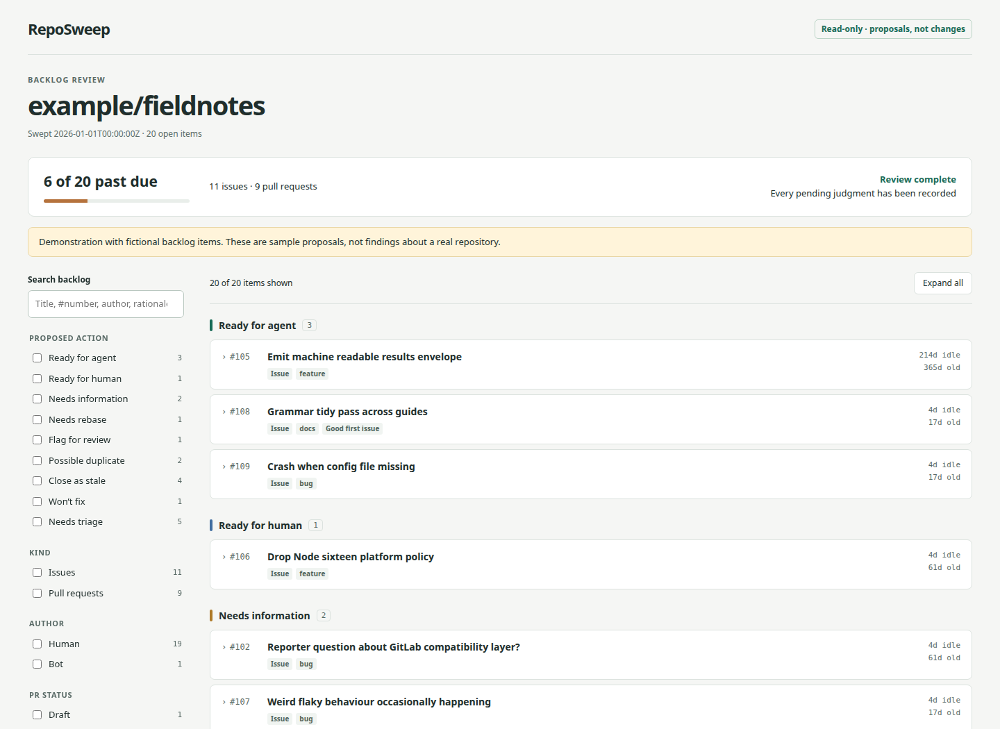

# RepoSweep

Turn an issue and pull-request backlog into a reviewable set of proposed actions.
Open one HTML file to see what is ready for an agent, what needs a person, what
needs information, and what might be stale or duplicated.

**Nothing is closed, relabelled, commented on, or pushed.** You make those decisions.

[Open the sample report](docs/demo/index.html) after cloning, or generate it with
`sh examples/generate-demo.sh`. The sample is fictional and works offline.



## Run a sweep

Requires authenticated **GitHub CLI**, **jq 1.6+**, **Git**, and standard POSIX
shell utilities. No Python, Node, model API key, or build step is required.

Clone this repository, then tell your coding agent:

> Read `/path/to/RepoSweep/skills/reposweep/SKILL.md` and sweep `/path/to/my-project`.

That is the complete workflow. The agent runs the mechanical pass, reviews
flagged items in small batches, confirms or rejects title-match nominations,
and returns the finished report. It works with any agent that can read files
and run shell commands. You can also install the complete `skills/reposweep/`
folder in your harness's skill directory.

For a **mechanical-only first look**, without an agent:

```sh
sh /path/to/RepoSweep/skills/reposweep/scripts/reposweep /path/to/my-project
```

Open `/path/to/my-project/.reposweep/runs/latest/report.html`. It is explicitly
marked preliminary until all pending judgments and duplicate pairs are reviewed.
The script itself does not call an LLM.

## What it proposes

| Issues | Pull requests |
| --- | --- |
| Ready for agent, ready for human | Needs rebase, flag for review |
| Needs information, possible duplicate, won't fix, close as stale | Same shared actions |
| Needs triage when no other action is supported | Needs triage, with a healthy flag for fresh clean PRs |

Rules are first-match, not scores. A queued item is exempt from staleness.
Only **small, explicitly clean, idle PRs** can receive a stale-close proposal;
large, conflicted, blocked, or unknown old PRs go to human review. Drafts and
bots are included and filterable. Age alone is never proof of obsolescence.

Title overlap only nominates same-kind pairs. The agent reads both descriptions
before confirming a duplicate; the lowest item number is canonical. Duplicate
proposals still require your confirmation before any closure.

The report includes searchable action groups, combinable facet filters with
live counts, per-item reasoning and rule provenance, duplicate groups, and a
past-due summary. It embeds its data, CSS, and JavaScript and makes no network
requests when opened. Links open the original tracker items.

## Tune the thresholds

Zero configuration is required. Optionally add `reposweep.env` at the **target
repository root**, containing only the values you want to change:

```ini
STALE_DAYS=90
NEEDS_INFO_DAYS=14
DEDUP_MAX_PARTNERS=3
```

Precedence is shipped [defaults](skills/reposweep/defaults.env), then
`reposweep.env`, then environment variables. Values are non-negative integers;
comments and partial overrides work. Unknown keys are ignored. The file is
parsed as data, not sourced as shell. `DEDUP_MAX_PARTNERS=0` disables nomination.

The five role-to-label mappings come from the target's
`docs/agents/triage-labels.md`, when present, using
[this table format](docs/agents/triage-labels.md). Otherwise role names are the
label strings. Both the mapping and effective thresholds are frozen in each
run's `meta.json`. The ladder order and bin set are not configurable.

## Resume, inspect, and share

A run lives at `.reposweep/runs/<UTC timestamp>/`. `latest` points to the newest
successful mechanical run. Files include:

- `meta.json`: repository, fetch timestamps, thresholds, label mappings, counts.
- `github-items.jsonl`: recorded GitHub responses, including bodies for review.
- `items.jsonl`: the normalized snapshot, independent of tracker field names.
- `verdicts.jsonl`: one checkpointed verdict per item, including pair decisions.
- `report.html`: the report as of its last rendering.

Ask your agent to resume a run rather than start another sweep. Completed work
is skipped. [The skill](skills/reposweep/SKILL.md) documents the bounded
`review.sh next` / `review.sh apply` interface. Each apply validates the entire
batch and atomically replaces the checkpoint; invalid batches leave it intact.
Regenerate HTML after applying judgments with `report.sh RUN_DIR`.

A run lock prevents concurrent writers. After a hard interruption, confirm no
RepoSweep process is using the run before removing its `.lock/` directory.
Preserve any complete raw responses there if you intend to recover a partial
snapshot. Review checkpoints can resume; fetching does not yet support resume.
A failed fetch normally requires a new sweep and does not replace `latest`.
Old pre-checkpoint-format runs can still be opened as HTML, but start a new run
to use the current review tools.

To share, send the HTML file. For GitHub Pages, `report.sh --publish RUN_DIR
TARGET_REPO_DIRECTORY` prints two commands to copy and publish it under
`docs/reposweep/`. You run those commands on your chosen publishing branch.
Pages must already serve that repository's `docs/` directory.

**Review before sharing.** The HTML embeds every verdict, including filtered-out
items. Run directories also contain issue bodies. Keep `.reposweep/` out of
version control in the target repo; RepoSweep does not edit its `.gitignore`.
Your agent's existing provider handles any issue text you give it.

## Development

```sh
sh skills/reposweep/tests/run-tests.sh
sh examples/generate-demo.sh
```

Focused offline checks cover classification, config precedence, duplicate
nomination, and checkpoint integrity. Browser rendering and the GitHub adapter
are checked end to end; see [verification and issue coverage](docs/verification.md).
The report demo uses fictional decisions, not an LLM evaluation.

Tracker-specific fetching and field translation live in `fetch-normalize.sh`
and `normalize.jq`. Another tracker needs an adapter producing the same item
shape plus recorded bodies for review; classification and rendering stay the same.
GitHub pagination is a live read, not a transaction. Very large backlogs cost
one detail request per PR, and lexical duplicate nomination compares title pairs.
An unknown merge state remains unknown after one retry.

### Current trial limitations

The first Loris trial hit a caller-imposed 200-second timeout during fetching.
A clearly labelled report was recovered from 313 of 697 listed items; none of
its agent review was completed. Allow long-running fetches rather than wrapping
them in a short tool timeout. Process exit status alone is not sweep completion.

Partial recovery is currently manual. The renderer does not yet read partial
snapshot metadata, so rerendering a recovered report can lose its manually added
warning. [The trial record](docs/verification.md#loris-trial-and-partial-recovery)
distinguishes this from the successful small-repo and recorded-data checks.

For ongoing development, read [the handoff](docs/handoff.md) before choosing
the next task. It records the uncommitted cleanup and remaining operational work.
